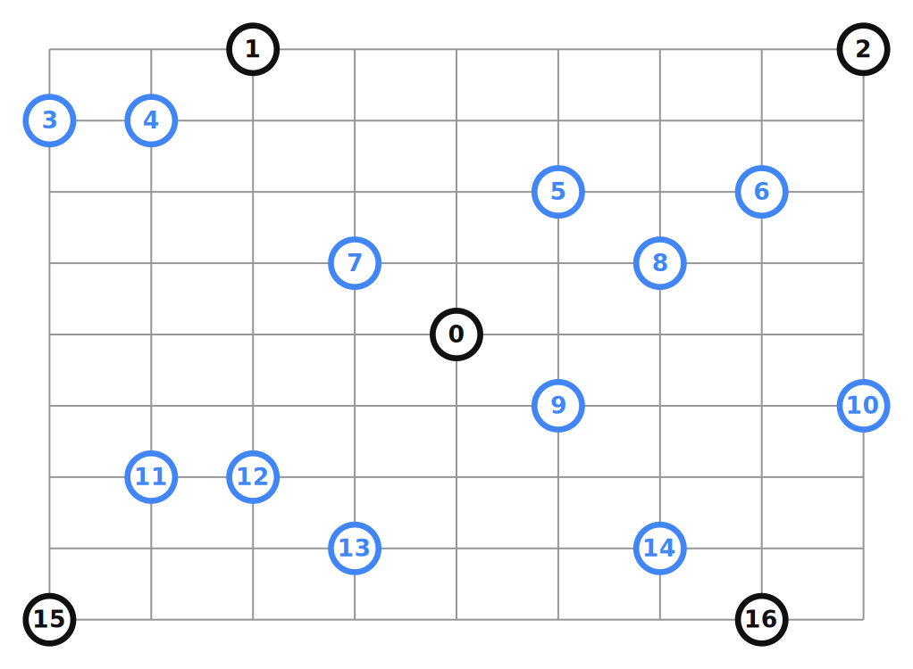

# Route Management
Note: Let's not reinvent the wheel. Everyone already knows its an NP-Hard Problem, so it's best to use a well used existing solution. The goal is to use our intelligence to optimize the solution, not solve the traveling salesman problem.

## Overview 

The goal is to find optimal routes for multiple Volunteers visiting a set of a known locations. The Volunteers originate from different base stations. (When there's only one volunteer, it reduces to the Traveling Salesman Problem.)

*Optimal Route Definition (Tentative)*: Minimize the length of the longest single route among all volunteers.

### Possibile Constraints
1. Total Time/Day of every volunteer.
2. Maximize number of non-target households between target locations. E.g. Red Team volunteer has house (7) and House (3) as targets, but visits 1 and 4 as bonus.

NOTE: Constraint 2 is currently not a priority.

## Deliverables
1. Route Management API that can be updated with new Volunteers or New Locations

